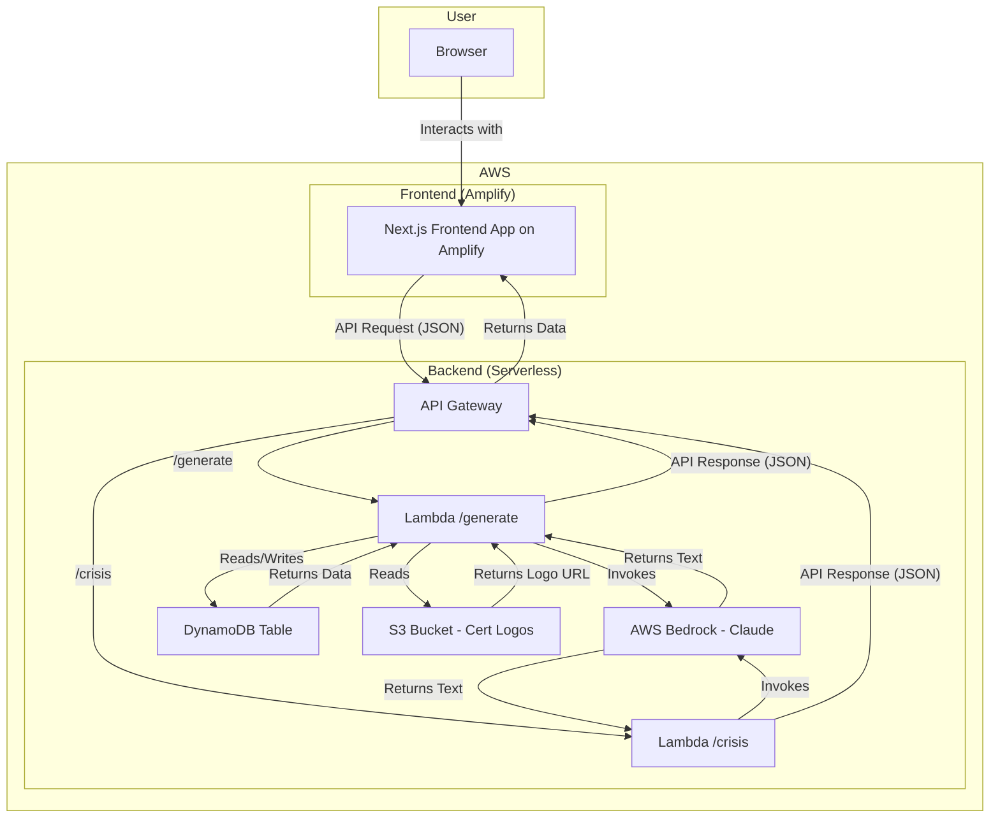
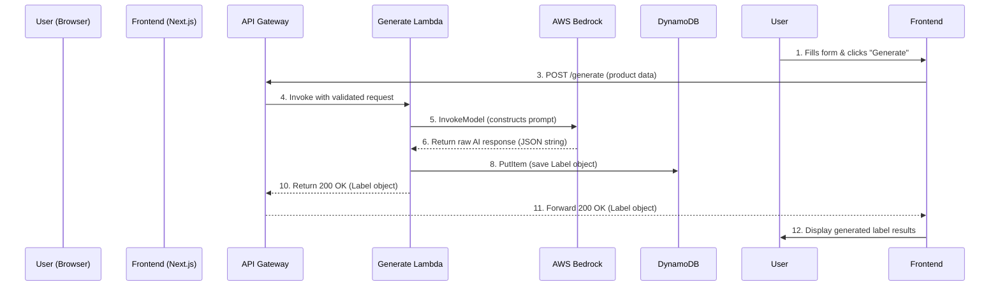
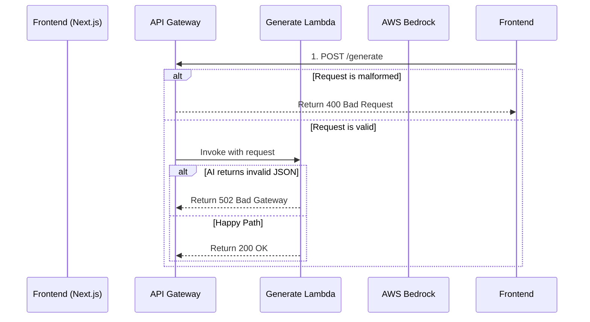

# **Fullstack Architecture Document: SmartLabel AI**

**Version:** 1.0
**Date:** September 17, 2025
**Author:** Winston, Architect 🏗️

### **1. Introduction**

This document outlines the complete fullstack architecture for SmartLabel AI, including backend systems, frontend implementation, and their integration. It serves as the single source of truth for AI-driven development, ensuring consistency across the entire technology stack.

#### **Starter Template or Existing Project**

This is a greenfield project. The technical stack specifies a Turborepo Monorepo with React (`shadcn/ui`, Tailwind CSS) for the frontend and Node.js on AWS Lambda for the backend. The most effective approach is to initialize a `Turborepo` from scratch and configure it with two primary applications: `web` (a Next.js application) and `api` (a collection of serverless functions managed by AWS SAM).

#### **Change Log**

| Date | Version | Description | Author |
| :--- | :--- | :--- | :--- |
| Sep 17, 2025 | 1.0 | Initial architecture draft based on PRD and UI/UX Spec | Winston, Architect |

### **2. High-Level Architecture**

#### **Technical Summary**

SmartLabel AI will be implemented as a serverless web application using a monorepo structure. The frontend is a responsive React application built with Next.js and hosted on **AWS Amplify** for optimal performance and alignment with the AWS ecosystem. The backend consists of AWS Lambda functions fronted by an API Gateway, providing a scalable, pay-per-use infrastructure. The core generative logic is handled by invoking the Claude model via AWS Bedrock, with DynamoDB used for data persistence and S3 for storing static assets like certification logos.

#### **Platform and Infrastructure Choice**

  * **Platform:** AWS will be the primary cloud provider for all backend, AI, and frontend services, aligning with the hackathon's technical focus.
  * **Key Services:**
      * **AWS Amplify:** For hosting the Next.js frontend application.
      * **AWS Lambda:** For serverless compute for our API endpoints.
      * **AWS API Gateway:** To create, manage, and secure our REST API.
      * **AWS Bedrock:** To access the Claude generative AI model.
      * **Amazon DynamoDB:** A serverless NoSQL database for storing generated label data.
      * **Amazon S3:** For storing static assets like certification logos.

#### **Repository Structure**

  * **Structure:** We will use a **Monorepo** managed by **Turborepo**.
  * **Package Organization:** The monorepo will contain `apps/web`, `apps/api`, and shared packages like `packages/shared`.

#### **High-Level Architecture Diagram**



#### **Architectural Patterns**

  * **Serverless Architecture:** The entire backend is built on managed, serverless services for automatic scaling and reduced operational overhead.
  * **Monorepo:** The frontend, backend, and shared code live in a single repository to enable seamless type sharing and atomic cross-stack changes.
  * **API Gateway Pattern:** A single, unified entry point for all frontend API requests to centralize concerns like request validation and authentication.

### **3. Tech Stack**

This table is the single source of truth for the development team.

| Category | Technology | Version | Purpose | Rationale |
| :--- | :--- | :--- | :--- | :--- |
| **Monorepo Tool** | Turborepo | Latest | Manage the monorepo and orchestrate builds | Provides high-speed builds and caching with minimal configuration, ideal for hackathon velocity. |
| **Package Manager**| pnpm | 8.x | Monorepo dependency management | Extremely fast and disk-efficient, using a standard `node_modules` layout for maximum compatibility. |
| **Frontend Language**| TypeScript | 5.x | Primary language for the frontend | Ensures type safety, improves developer experience, and integrates seamlessly with Next.js. |
| **Frontend Framework**| Next.js | 14.x | React framework for the web application | Provides a production-ready, batteries-included environment with optimizations that save development time. |
| **UI Component Library**| `shadcn/ui` | Latest | Accessible and composable UI components | Aligns with the PRD and UI/UX spec, providing high-quality components that are easily styled with Tailwind CSS. |
| **Styling** | Tailwind CSS | 3.x | Utility-first CSS framework | Enables rapid, consistent, and responsive UI development. |
| **State Management** | Zustand | Latest | Lightweight state management | A simple, unopinionated library for managing shared client state with minimal boilerplate. |
| **Data Fetching** | TanStack Query | v5 | Asynchronous state management | The industry standard for fetching, caching, and updating server data in React, simplifying API interactions. |
| **Form Management** | React Hook Form | Latest | Performant form state management | Robust and performant way to manage our input forms, including validation. |
| **Backend Language** | TypeScript | 5.x | Primary language for the backend | Provides type safety for Lambda functions and enables shared types with the frontend. |
| **Backend Runtime** | Node.js | 20.x (LTS) | JavaScript runtime for AWS Lambda | LTS version ensures stability and performance for our serverless functions. |
| **IaC & Deploy** | AWS SAM CLI | Latest | Define and deploy serverless resources | AWS-native choice for Infrastructure as Code, simplifying the deployment of Lambda, API Gateway, and DynamoDB. |
| **API Style** | REST | v1 | API standard for client-server communication | Managed via API Gateway, it's a simple, well-understood standard for our application's needs. |
| **Database** | Amazon DynamoDB | N/A | Serverless NoSQL database | Perfectly matches our serverless architecture, offering high performance, scalability, and a pay-per-use model. |
| **GenAI Service** | AWS Bedrock | N/A | Managed Generative AI service | Provides access to the powerful Claude model without the overhead of managing infrastructure. |
| **File Storage** | Amazon S3 | N/A | Object storage for static assets | Reliable and scalable storage for assets like certification logos. |
| **Schema Validation**| Zod | Latest | TypeScript-first schema validation | Used in the backend to validate the structure of the AI's response, ensuring data integrity. |
| **Frontend Testing**| Jest & RTL | Latest | Component and unit testing | The standard, integrated testing suite for Next.js, enabling robust UI testing. |
| **E2E Testing** | Playwright | Latest | End-to-end browser automation | A modern and reliable tool for our single critical-path E2E test. |
| **CI/CD** | GitHub Actions | N/A | Automation for build, test, and deploy | A standard, powerful tool for automating our development pipeline within our code repository. |

### **4. Data Models**

The following TypeScript interfaces will be defined in the `packages/shared` directory to serve as a single source of truth for our data structures.

#### **`Label`**

**Purpose:** To store the complete record of a single, AI-generated food label.

**TypeScript Interface:**

```typescript
export interface NutritionValue {
  value: number;
  unit: 'g' | 'mg' | 'kcal' | 'kJ' | string;
}

export interface NutritionServingInfo {
  per100g: NutritionValue;
  perServing?: NutritionValue;
  percentDailyValue?: number;
}

export interface NutritionFactSheet {
  energy?: NutritionServingInfo;
  fat?: NutritionServingInfo;
  // ... other nutrients
  [key: string]: NutritionServingInfo | undefined;
}

export interface LegalLabel {
  ingredients: string;
  allergens: string;
  nutrition: NutritionFactSheet;
  // ... other fields
}

export interface MarketingInfo {
  short: string;
  // ... other fields
}

export interface LabelData {
  legalLabel: LegalLabel;
  marketing: MarketingInfo;
  warnings: string[];
  complianceNotes: string[];
}

export interface Label {
  labelId: string;
  productId?: string;
  // ... other metadata fields
  labelData: LabelData;
}
```

#### **`CrisisLog`**

**Purpose:** To store an audit record of a crisis response generation.

**TypeScript Interface:**

```typescript
export interface CrisisLog {
  crisisId: string;
  productId?: string;
  timestamp: string;
  productName: string;
  // ... other fields
}
```

### **5. API Specification**

The API contract is defined using the OpenAPI 3.0 standard. All endpoints are protected by an API Key. The AI's JSON response will be validated using Zod on the backend before being sent to the client.

```yaml
openapi: 3.0.0
info:
  title: "SmartLabel AI API"
  version: "1.0.0"
paths:
  /generate:
    post:
      summary: "Generate a new food label"
      # ...
  /translate:
    post:
      summary: "Translate an existing label"
      # ...
  /crisis:
    post:
      summary: "Generate a crisis response package"
      # ...
components:
  securitySchemes:
    ApiKeyAuth:
      type: apiKey
      in: header
      name: x-api-key
  schemas:
    # ... all request and response schemas
```

### **6. Components**

The codebase is broken down into the following logical components, which map to our monorepo structure.

  * **`Shared Types Package (@smartlabel/shared)`**: Provides a single source of truth for all data structures (TypeScript interfaces).
  * **`UI Component Library (@smartlabel/ui)`**: Contains all reusable React components as defined in the UI/UX Specification.
  * **`Web Application (apps/web)`**: The primary Next.js user interface, responsible for rendering all pages and communicating with the backend API.
  * **`Label Generation Service (apps/api/generate.ts)`**: A serverless function within the `apps/api` SAM application responsible for the `/generate` endpoint.
  * **`Crisis Simulation Service (apps/api/crisis.ts)`**: A serverless function for the `/crisis` endpoint.
  * **`Translate Service (apps/api/translate.ts)`**: A serverless function for the `/translate` endpoint.

### **7. External APIs**

For the scope of the Geekathon MVP, the application is designed to be fully self-contained within our AWS ecosystem. **There are no integrations with external, third-party APIs.** This is a strategic decision to reduce complexity and focus on the core GenAI innovation. A production roadmap would include integrations with ERPs and regulatory databases.

### **8. Core Workflows**

The following sequence diagrams illustrate how the components interact to fulfill user requests, including a robust error handling flow.

#### **Successful Label Generation**



#### **Generation with Error Paths**



### **9. Database Schema**

We will use a **multi-table design** in DynamoDB for simplicity and clarity in the MVP.

#### **`LabelsTable`**

  * **Table Name:** `SmartLabel-Labels`
  * **Primary Key:** `labelId` (String)
  * **Global Secondary Index (GSI):** `by-product` on `productId` (String) to support future queries.
  * **AWS SAM Definition:**
    ```yaml
    LabelsTable:
      Type: AWS::DynamoDB::Table
      Properties:
        TableName: SmartLabel-Labels
        BillingMode: PAY_PER_REQUEST
        AttributeDefinitions:
          - { AttributeName: labelId, AttributeType: S }
          - { AttributeName: productId, AttributeType: S }
        KeySchema:
          - { AttributeName: labelId, KeyType: HASH }
        GlobalSecondaryIndexes:
          - IndexName: by-product
            KeySchema:
              - { AttributeName: productId, KeyType: HASH }
            Projection:
              ProjectionType: ALL
    ```

#### **`CrisisLogsTable`**

  * **Table Name:** `SmartLabel-CrisisLogs`
  * **Primary Key:** `crisisId` (String)
  * **Global Secondary Index (GSI):** `by-product` on `productId` (String).
  * **AWS SAM Definition:** *(Similar to LabelsTable)*

### **10. Unified Project Structure**

The monorepo file structure is organized for clarity and separation of concerns. A "Developer Onboarding" guide will be added to the root `README.md` to explain the layout.

```plaintext
smartlabel-ai/
├── apps/
│   ├── api/                  # AWS SAM Serverless Application
│   │   ├── src/
│   │   │   └── handlers/
│   │   │       ├── generate.ts
│   │   │       ├── crisis.ts
│   │   │       └── translate.ts
│   │   └── template.yaml      # IaC definition
│   └── web/                  # Next.js Frontend Application
│       ├── src/
│       │   └── app/
│       └── ...
├── packages/
│   ├── shared/               # Shared TypeScript types
│   ├── ui/                   # Shared React component library
│   └── config/               # Shared configurations (ESLint, etc.)
├── package.json
└── turbo.json
```

### **11. Development Workflow**

The local development workflow is streamlined for developer productivity.

  * **Prerequisites:** Node.js, pnpm, AWS CLI, SAM CLI, Docker.
  * **Setup:** A developer runs `pnpm install` after cloning.
  * **Run:** A single command, `pnpm dev`, starts all necessary local services in parallel (Next.js dev server and `sam local start-api`).

### **12. Deployment Architecture**

The application uses a hybrid CI/CD pipeline orchestrated from GitHub.

  * **Frontend Deployment (via AWS Amplify):** A `git push` to the `main` branch triggers an Amplify build and deployment, configured via an `amplify.yml` file. Pull Requests will generate unique preview deployments.
  * **Backend Deployment (via GitHub Actions & AWS SAM):** A GitHub Actions workflow will use the AWS SAM CLI to deploy the serverless backend to AWS, triggered only on changes to the `apps/api` or `packages/shared` directories.

### **13. Security and Performance**

  * **Security:** The architecture includes a multi-layered defense against API abuse (API Keys, Throttling) and GenAI attacks (Prompt Injection), and follows the Principle of Least Privilege for all IAM roles.
  * **Performance:** The primary goal is a `<15 second` response for a cold start and a target of `<5 seconds` for warm requests. A key strategy is managing perceived performance with the "AI Generation Trace" animation. Caching is deferred to the post-hackathon roadmap.

### **14. Testing Strategy**

The project follows a pragmatic testing pyramid as defined in the PRD.

  * **Unit Tests (Jest & RTL):** Form the base of the pyramid, covering individual components and functions.
  * **Integration Tests:** Verify key backend logic with its dependencies.
  * **End-to-End Test (Playwright):** A single, critical-path E2E test validates the core user journey from the UI to the AI and back.

### **15. Coding Standards**

A minimal set of critical rules will be automatically enforced via a shared ESLint preset and a manual Pull Request template checklist.

  * **Critical Rules:** Enforce the use of the `@smartlabel/shared` package for types, TanStack Query for data fetching, and the secure pattern for AI prompting.
  * **Naming Conventions:** Standardized naming for components, hooks, API routes, and database tables.

### **16. Finalization and Next Steps**

The architecture is complete, robust, and aligned with all project requirements. It is **ready for implementation**.
